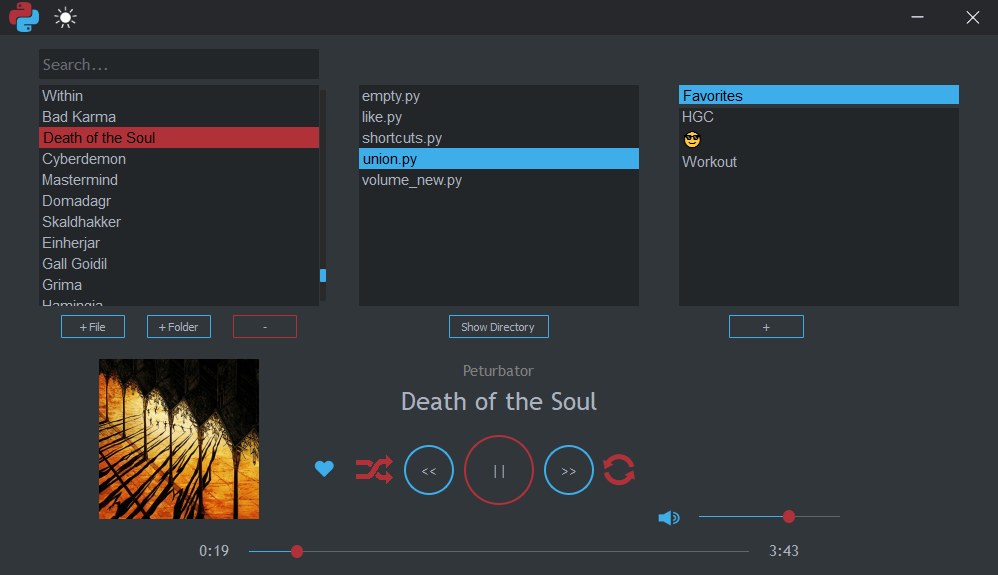

# MPy3
### Installation

* pip3 install python-vlc (Also needed [libvlc](https://www.videolan.org/vlc/libvlc.html) __OR__ [vlc](https://www.videolan.org/vlc/index.pl.html))
* pip3 install filelock
* pip3 install ultra_sockets
* pip3 install PyQt5
* pip3 install eyed3

### Overwiew
  

It's an MP3 player.
You can also write custom Python functions to interact with it (pause/play, change vokume, track, playlist, toggle shuffling, etc) and extract data (check which song/playlist is currently playing, its volume, artist, etc)

### Usage

Run `main.py` to start the app.

Optionally, you may pass a path as an argument to play that song.
`cd C:\mp3-player & python3 main.py "C:\przyklad.mp3"
`
### User guide
You may toggle dark/light mode by clicking the top left corner icon (sun/moon, not MPy3 logo).

The three main lists contain:
* songs in current playlist
* Function files (more about that later)
* playlists

`<3` allows easier adding and removing from `Favorites`

Buttons:
`+ File` adds 1 song to your current playlist
`+ Folder` adds all songs from selected folder
(under left list) `-` deletes current song

`+` Adds a playlist
(under left list) `-` deletes a playlist.

### Custom functions
in the `user_functions` folder, users may add their custom Python scripts.
To select a script, open MPy3 and click on it. It will restart to import functions `start_func()` and `song_func()`.

Mpy3 will __always__ execute `start_func()` before showing the GUI, `song_func()` is executed every time a song begins.

`start_func()`
* executed before showing the GUI
* MPy3 will not proceed until it ends

`song_func()`
* executed every time a song begins.
* Threaded - does not stop songs from playing (you may use 'P.pause()' to stop it)

There are a few examples included inside this repository.

To interact with MPy3 `playback` and `F` in your scripts.
Out of curiosity and wanting to learn, I skipped readability best practices and monkey patched these functions. There's no need to import them in any way.

* `playback` - `dict` - contains internal variables, such as volume or song name.
* `F` - `class` - contains function that can be used to manipulate MPy3, such as `set_song_by...()` or `set_volume()`

### `playback` Documentation

__IMPORTRANT:__ Always use `F` to change any of these variables! It ensures everything goes smoothly.

* `playback['path']`:`str`
Full song path
* `playback['full_track']`:`str`
Full track name
* `playback['track']`: `str`
Track name
* `playback['is_playing']`:`bool`
Is current song playing (is not paused)?
* `playback['time']`:`int`
how much of song's time has passed
* `playback['length']`:`int`
Song's length
* `playback['length_mins']`:`str`
how much of song's time has passed (in the `00:00` format)
* `playback['time_mins']`:`str`
Song's length (in the `00:00` format)
* `playback['volume']`:`int`
Song's current volume
* `playback['hidden_volume']`:`int`
Song's current volume, but independent of muting.
when Mpy3 is unmuted, "actual" volume will return to this value.
* `playback['id']`:`int`
Song's id in the current playlist
* `playback['playlist']`:`list`
all paths to current playlist's songs
* `playback['shuffled_playlist']`:`list`
`playback['playlist']`, but shuffled. Used when shuffling is enabled.
* `playback['playlist_id']`:`int`
playlist id
* `playback['shuffle']`:`bool`
Is shuffling enabled?
* `playback['loop']`:`bool`
Is looping enabled?
* `playback['module']`:`str`
Currently used `user_functions` file
* `playback['artist']`:`str`/`None`
Song's author
* `playback['image']`:`str`/`None`
path to current cover art, if it exists.
* `playback['in_favorites']`:`bool`
Is this song marekd as "Favorite"?
* `playback['dark_mode']`:`int`
Is dark mode enabled?

### `F` Documentation

* `F.set_song_by_id(id)`
From current playlist, play a song with this id
* `F.set_song_by_path(path)`
From current playlist, play a song with this path
* `F.set_song_by_name(name)`
From current playlist, play a song with this name
* `F.set_volume(volume)`
Set current volume.
* `F.play()`
Play
* `F.pause()`
Pause
* `F.set_time(seconds)`
Jump to specified time in the song.
Must be an `int`, not `float`.
* `F.change_playlist(id)`
Set current playlist
* `f.toggle_shuffle()`
Toggle shuffling songs
* `f.set_loop(number)`
0 = no looping
1 = start from the beginning once the playlist os over
2 = listen to only this song
* `F.change_module(module)`
set user function
* `F.listener(ip, port)`
__EXPERIMENTAL FUNCTION__, tested only in `start_func()`
opens a port(5556 by default) from specified ip (your device's local IP by default) and listens.
When the port is open, you can connect to it locally from a different application.
files `example_communicator.py` and `sender.py` contain necessary functions and instructions.
